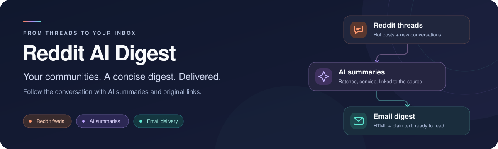
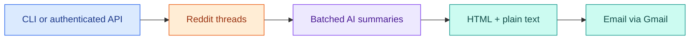

<p align="center">
  
</p>

<p align="center">
  
  
  
  
  
</p>

<p align="center">
  <strong>Your communities. A concise digest. Delivered.</strong><br />
  Turn Reddit threads into AI summaries and receive them in one email.
</p>

<p align="center">
  <a href="#setup"><strong>Get started</strong></a> ·
  <a href="#usage">Usage</a> ·
  <a href="#configuration">Configuration</a> ·
  <a href="#development">Development</a>
</p>

## At a glance

Reddit AI Digest fetches Reddit threads, summarizes them through a Responses API compatible model, and delivers an HTML and plain text email digest. Run it from the command line or an authenticated FastAPI endpoint.

| 🟠 Follow your communities | ✨ Summarize with AI | 📬 Read in your inbox |
| --- | --- | --- |
| Collect hot and new threads from configured subreddits. | Generate summaries in bounded, asynchronous batches. | Receive a digest grouped by subreddit, with links to the original posts. |

## How it works



The digest skips pinned posts, combines hot listings with up to three new threads per subreddit, and removes duplicates within each subreddit. Summaries are grouped by subreddit, with titles and links taken from the original Reddit posts. External articles and comments are not downloaded; link posts are summarized from their Reddit metadata.

Reddit fetches and model batches run with bounded concurrency. Valid partial results can be delivered when some listings or batches fail; failures are logged. A run stops without sending when no posts or usable summaries remain.

## Setup

Requires Python 3.12+, [uv](https://docs.astral.sh/uv/), Reddit API credentials, a model endpoint, and a Gmail account with an app password.

From the repository root:

```bash
uv sync --locked
cp .env.example .env
```

Fill in [.env.example](.env.example)'s required settings in your local `.env`. Keep credentials out of Git. Use `uv sync --locked --no-dev` for a runtime-only installation.

## Usage

### Command line

```bash
uv run --locked -m src.raid
```

This contacts Reddit and the configured model, then sends one email to `TO_EMAIL`. Hosted model calls may incur charges. A successful run logs Gmail's acceptance; a failed run exits with a nonzero status.

`./run.sh` and `uv run --locked src/raid.py` are also supported. The CLI uses `CLI_SUBREDDITS` in [src/raid.py](src/raid.py): LocalLLaMA, singularity, LocalLLM, codex, machinelearningnews, and AI_Agents. It requests seven hot posts per subreddit and summarizes in batches of eight.

### HTTP API

Set `DIGEST_API_TOKEN` to a random secret before using the API, then start the server:

```bash
uv run --locked uvicorn src.app:app --reload --host 127.0.0.1 --port 8000
```

Check [health](http://127.0.0.1:8000/health) for `{"status":"ok"}`, or open [API documentation](http://127.0.0.1:8000/docs). Health confirms the process is running; it does not contact providers.

To send a digest, export the same token in your calling shell and run:

```bash
curl --fail-with-body -X POST http://127.0.0.1:8000/digest \
  -H "Authorization: Bearer $DIGEST_API_TOKEN"
```

Success returns `{"message":"Digest email sent successfully!","posts":24}`, where the count reflects that run. The API uses `API_SUBREDDITS`: LocalLLaMA, reactjs, Python, and javascript. It requests six hot posts per subreddit and summarizes in batches of ten.

`GET /digest` returns 405. Missing or incorrect tokens return 401; an unset server token disables the endpoint with 503. Overlapping digests in the same worker return 409. Provider or delivery failures return 502, and the overall deadline returns 504. If delivery fails or times out after submission, check the recipient before retrying: SMTP does not guarantee an exactly-once outcome.

## Configuration

| Variable                            | Purpose                                                                                                 |
| ----------------------------------- | ------------------------------------------------------------------------------------------------------- |
| `CLIENT_ID`, `CLIENT_SECRET`        | Required Reddit application credentials.                                                                |
| `GMAIL_EMAIL`, `GMAIL_APP_PASSWORD` | Required Gmail sender address and app password.                                                         |
| `TO_EMAIL`                          | Required single recipient address.                                                                      |
| `OPENAI_API_KEY`                    | Required for the OpenAI endpoint; `OPEN_AI_TOKEN` remains a supported alias.                            |
| `OPENAI_BASE_URL`                   | Defaults to `https://api.openai.com/v1`. Override for a compatible server.                              |
| `OPENAI_MODEL`                      | Defaults to `gpt-5-nano-2025-08-07`; must be available at your endpoint.                                |
| `DIGEST_API_TOKEN`                  | Bearer secret required to enable HTTP digest delivery. Not needed by the CLI.                           |
| `REDDIT_USER_AGENT`                 | Defaults to `python:reddit-ai-digest:0.1.0`; set an identifier appropriate for your Reddit application. |
| `DIGEST_TIMEOUT_SECONDS`            | Overall fetch, summarize, and send deadline; defaults to 300 seconds.                                   |
| `LOG_LEVEL`                         | `DEBUG`, `INFO`, `WARNING`, `ERROR`, or `CRITICAL`; defaults to `INFO`.                                 |

A local model server can use `OPENAI_BASE_URL=http://localhost:8080` and its own `OPENAI_MODEL`. Omit `OPENAI_API_KEY` if that server needs no authentication. The server must support the Responses API and the parameters used in [src/raid.py](src/raid.py). Hosted OpenAI authentication uses the [official SDK's API key convention](https://developers.openai.com/api/docs/libraries/).

Gmail uses TLS on port 465, with a port 587 STARTTLS fallback only when connection establishment fails. Failed message submissions are not retried automatically.

## Repository guide

| Path                                                               | Purpose                                                      |
| ------------------------------------------------------------------ | ------------------------------------------------------------ |
| [src/raid.py](src/raid.py)                                         | Digest orchestration, provider adapters, and CLI entrypoint. |
| [src/app.py](src/app.py)                                           | API routes, authentication, and client lifespan.             |
| [src/config.py](src/config.py)                                     | Validated environment configuration.                         |
| [src/models.py](src/models.py)                                     | Provider validation and internal data types.                 |
| [src/templates/email_template.py](src/templates/email_template.py) | HTML email layout and safe rendering.                        |
| [tests/](tests/)                                                   | Isolated regression tests with mocked providers.             |

## Development

```bash
uv run --locked pytest
uv run --locked ruff check src tests
uv run --locked ruff format --check src tests
uv run --locked mypy
uv lock --check
```

Tests use synthetic credentials and block socket connections. They cover parsing, rendering, API authorization, provider failures, concurrency, and resource cleanup. They do not verify live Reddit access, model availability, Gmail delivery, or email-client appearance.

## Deployment

[vercel.json](vercel.json) routes requests to the FastAPI application. Configure the same environment variables in the host, including `DIGEST_API_TOKEN`, and expose the API through HTTPS. The host's request duration limit must accommodate the digest; its limit can be shorter than `DIGEST_TIMEOUT_SECONDS`.

Requests complete synchronously. Overlap protection is per worker, so multiple workers or instances can still send duplicate digests. Hosted deployment and live provider delivery require separate verification.
